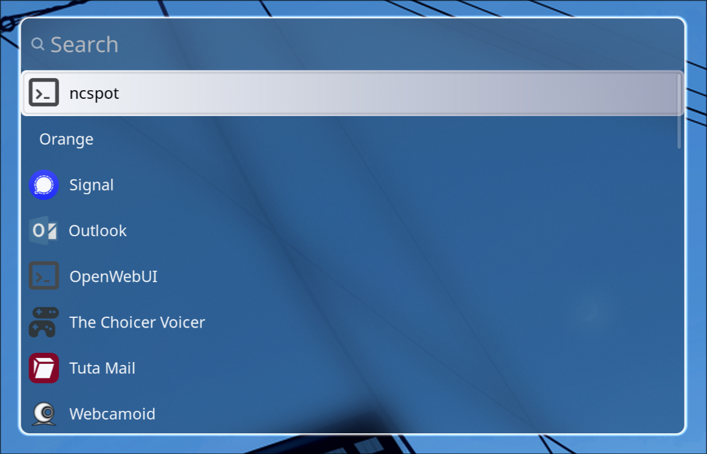

# wofi-dotfiles

## Requirements
* wofi v1.5.3

## Fonts
* SF Pro
Install:
- Arch: `yay -S otf-apple-sf-pro`
- Fedora/Debian/ubuntu: Must manually install
(https://developer.apple.com/fonts) install to `~/.local/share/fonts`

## Blur settings

### Hyprland (hyprland.lua)
1. 
`hl.config({
  decoration = {
		blur = {
			enabled = true,
			size = 6, 
			passes = 3, 
			xray = true, 
			ignore_opacity = true,
			noise = 0.02, 
			contrast = 1.0, 
			brightness = 1.0, 
			vibrancy = 0.2, 
			vibrancy_darkness = 0.2, 
			new_optimizations = true,
    },
  },
})`

2. 
`hl.layer_rule({
	match = { namespace = "waybar" },
	blur = true,
	ignore_alpha = 0.1,
})`

### Niri (config.kdl)
`blur {
    passes 3
    offset 3
    noise 0.02
    saturation 1.2
}`

### Mango (config.conf)
`blur=1
blur_layer=1
blur_optimized=1
blur_params_num_passes=3
blur_params_radius=6
blur_params_noise=0.02
blur_params_contrast=1.0
blur_params_brightness=1.0
blur_params_saturation=1.2`

## License / MIT — see [LICENSE](LICENSE)
